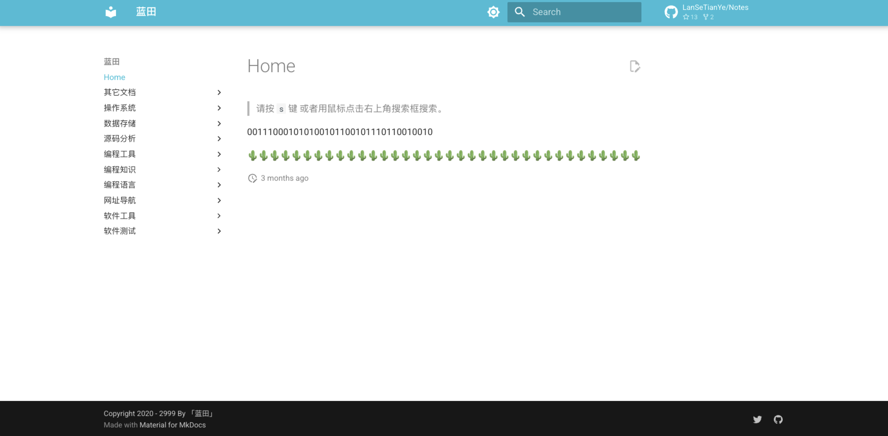

## Notes-Template

笔记模版项目，可以从这里 Fork，然后开始写自己的笔记。

* 笔记格式：Markdown。
* 入口页面：`README.md` 会被编译成 `index.html`，作为项目的入口。
* 目录结构：目录和项目里面保持一致，具体效果可参考： [https://note.sunfeilong.com](https://note.sunfeilong.com)
* 目录展示：目录下面有 `.md` 格式的文件才会展示，没有的话目录会被隐藏。
* 自定义样式：可以在 `stylesheets/extra.css` 文件自定义样式，样式会覆盖原有的样式。 
* 图片引用：图片放在 `imgs` 目录下，引用时使用相对路径，如下：

🌵🌵🌵🌵🌵🌵🌵🌵🌵🌵🌵🌵🌵🌵🌵🌵🌵🌵🌵🌵🌵🌵🌵🌵🌵🌵🌵🌵🌵🌵🌵🌵🌵🌵🌵🌵